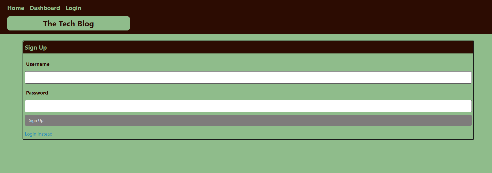
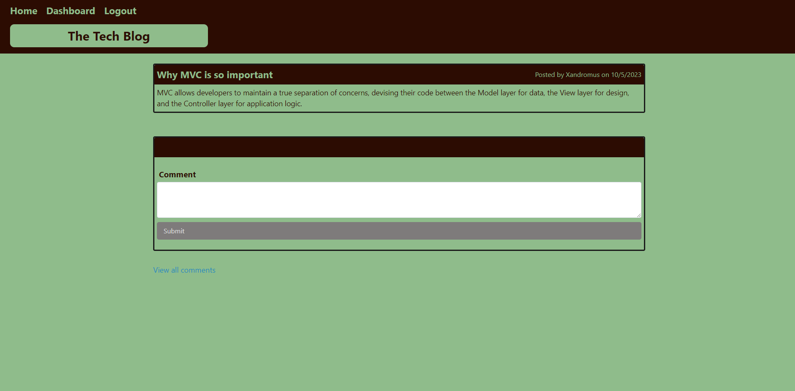
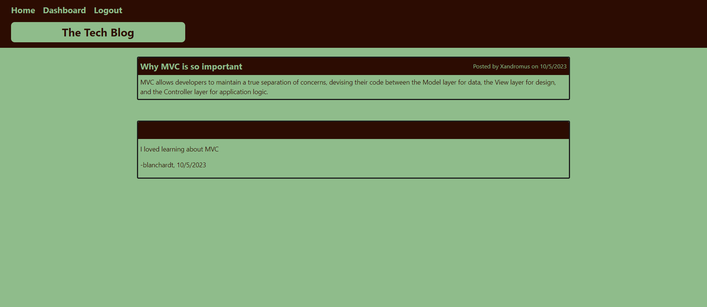
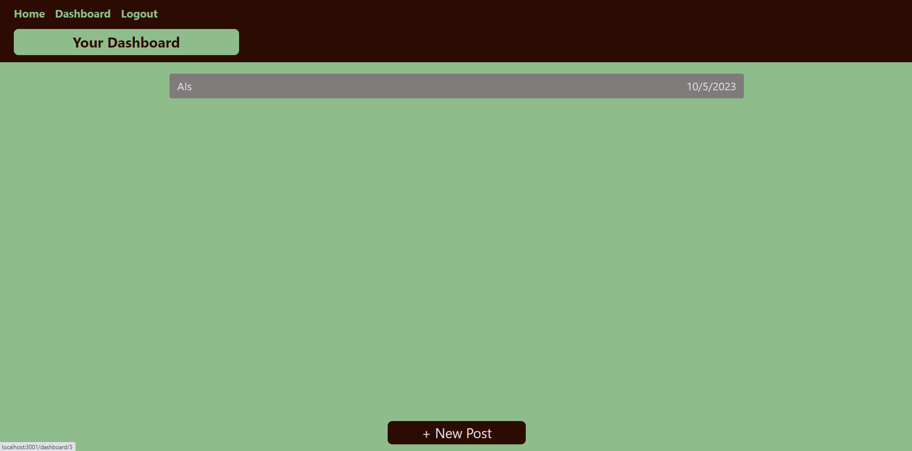
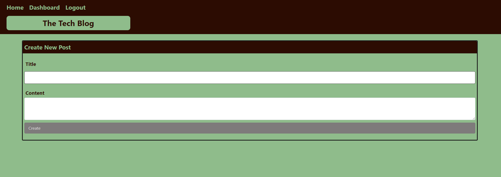
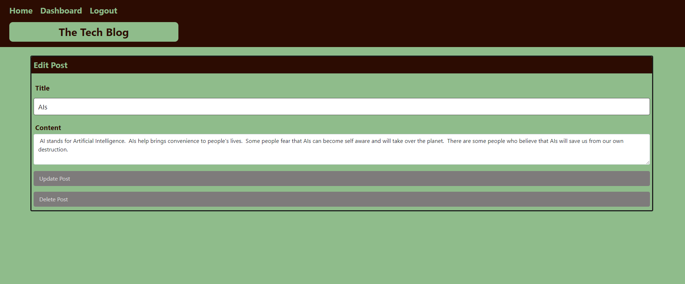

# trevors-blog-site  
  

## Description  
Allows users to create blogs, and comment on other peoples blogs.  

## Table of Contents  
* [Installation](#installation)  
* [Usage](#usage)  
* [Credits](#credits)  
* [License](#license)  
* [Contributing](#contributing) 
* [Questions](#questions)

## Installation  
To install necessary dependencies, run the following command:  

```  
npm install  
```  

## Usage  
Users are able to log in and out.  While they are not logged in they are only able to view all of the blogs and the comments for those blogs.  he user is able to sign up for an account if they do not already have one.  Once the user is logged in, they are now able to create their own blog posts, and comment on other blog posts.  In the navigation bar there will be a button to take users to the login page, if they are not already logged in, or a logout button to allow them to log out.  
Homepage:   
   
Login page:   
   
Signup page:    
   
Create Comment:   
   
All comments for selected blog post:   
   
Dashboard:   
    
Create Blog Post:   
   
Edit Blog Post:   
    

## Credits  
Created by: Trevor Blanchard  
Link to repo: https://github.com/blanchardt/trevors-blog-site   
Link to live site: https://trevors-blog-site-602922bbe279.herokuapp.com/  

## License  
This project is licensed under the MIT license.  

## Questions  
If you have any questions about the repo, open an issue or contact me directly at blanchardt@merrimack.edu.  You can find more of my work at [blanchardt](https://github.com/blanchardt/).  